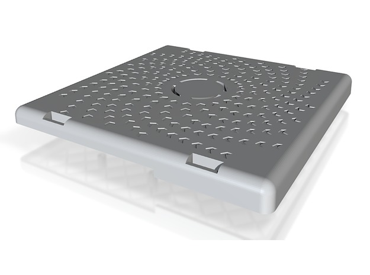
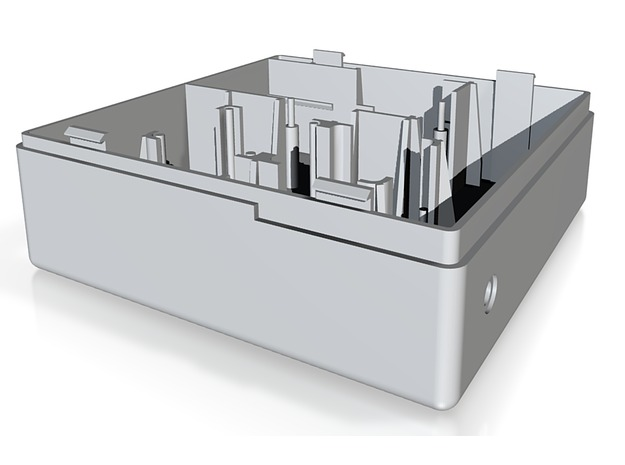

Low-Budget-Car-PC-Case
======================

Case for Tinkerforge IMU, GPS and MHS TinyCAN I-XL

####http://mechlab-engineering.de/references/low-budget-car-pc/
####http://vimeo.com/mechlabengineering/lowbudgetcarpc

## Case for

* [RaspberryPi](http://www.watterott.com/de/Raspberry-Pi-Model-B)
* [Tinkerforge IMU Brick](http://www.tinkerforge.com/de/doc/Hardware/Bricks/IMU_Brick.html)
* [Tinkerforge GPS Bricklet](http://www.tinkerforge.com/en/doc/Hardware/Bricklets/GPS.html)
* [Tinkerforge Power Supply](http://www.tinkerforge.com/de/doc/Hardware/Power_Supplies/Step_Down.html)
* [MHS Elektronik TinyCAN I-XL](http://www.mhs-elektronik.de/index.php?module=content&action=show&page=tinycan_hardware)

With plugable

* USB UMTS Stick
* Ethernet Cable

### Parts

## Size

The case has a dimension of `150x150x52mm`.

## Status

We are currently in `Beta` state, that means we 3D printed it already and at least the hardware fits the case. We are tryin' to optimize the cables and the structure for cheaper 3D printing.

[Take a look here](http://mechlab-engineering.de/2014/04/erste-lieferung-car-pc-cases-eingeflogen/)

## Licence

[CC-BY-SA2.0](http://creativecommons.org/licenses/by-sa/2.0/de/) Raphael Borkert

